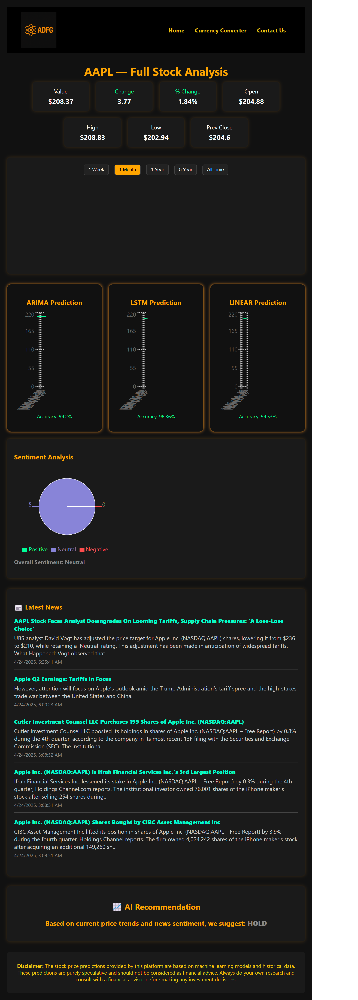
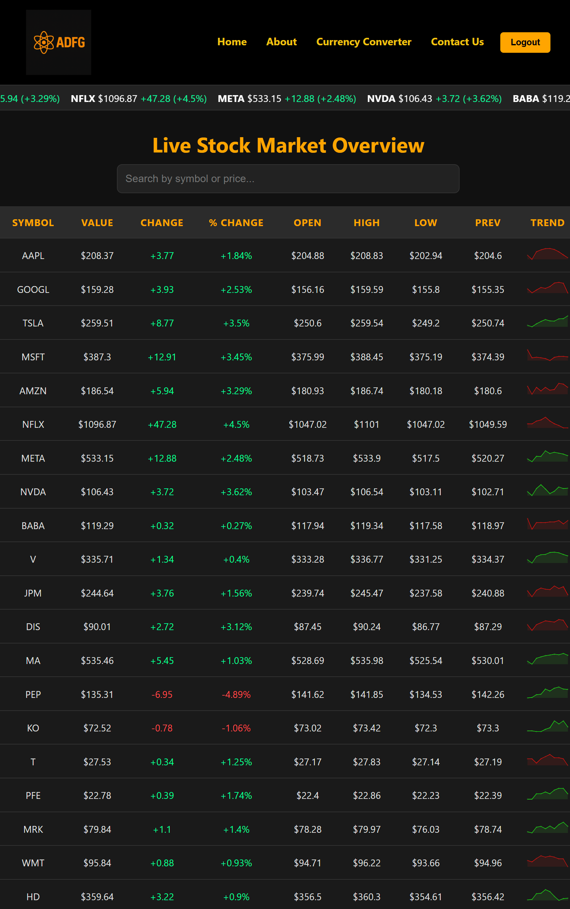
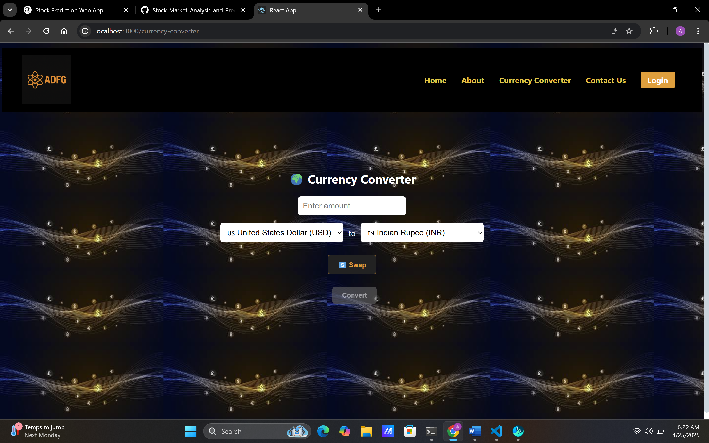

# Stock Market Analysis and Prediction Web App

A full-stack web app that shows live prices for NASDAQ and NSE stocks, forecasts the next 7 days with three models, reads the sentiment of recent financial news, and combines the two into a buy, sell or hold signal.

Built with FastAPI, React and SQLite.



## What it does

- **Live prices and trend charts** for NASDAQ and NSE stocks, from yfinance.
- **7-day forecasts** from three models, shown side by side: linear regression, ARIMA and LSTM.
- **News sentiment:** recent headlines from NewsAPI, each scored as positive, neutral or negative.
- **Buy, sell or hold signal** from the forecast trend and the news sentiment together.
- **Accounts:** register and sign in with JWT, manage a profile, and an admin area to manage users.
- **Currency converter** with live exchange rates.

## How it works

```
React front end  →  FastAPI back end  →  yfinance (prices)
                                      →  NewsAPI (headlines)
                                      →  SQLite (user accounts)
```

| Step | Detail |
|:--|:--|
| Data | Five years of daily closing prices per stock |
| Linear regression | Uses the previous two closes and a 5-day rolling mean |
| ARIMA | Order (5, 1, 0) |
| LSTM | Two layers, reading 30-day windows |
| Sentiment | Each headline scored with TextBlob |
| Signal | Buy when the forecast trends up and positive headlines outnumber negative ones, sell when both point down, otherwise hold |

## Screenshots

| Dashboard | Currency converter |
|:--|:--|
|  |  |

## Run it locally

You need Python 3.10 and Node.js, plus a free API key from [newsapi.org](https://newsapi.org).

**Back end**

```bash
cd backend
python -m venv venv
venv\Scripts\activate        # macOS/Linux: source venv/bin/activate
pip install -r requirements.txt
uvicorn app.main:app --reload
```

Before starting the back end, create a file named `.env` inside the `backend` folder with one line:

```
NEWS_API_KEY=your_key
```

**Front end**

```bash
cd frontend
npm install
npm start
```

The app opens at `http://localhost:3000` and talks to the API at `http://localhost:8000`.

## Limitations and next steps

- The model fit shown on the stock page (R²) is measured on the same history the models learn from. The next step is walk-forward validation on held-out data, reported as error in dollars.
- Models are retrained on each request. Training once and caching would make pages load much faster.
- TextBlob is a general-purpose sentiment scorer. A model trained on financial text would read headlines better.
- This is a learning project, not investment advice.

## Author

Ashok Reddy Bhimavarapu · [Portfolio](https://ashokreddy010.github.io) · [LinkedIn](https://www.linkedin.com/in/ashokreddy1)
